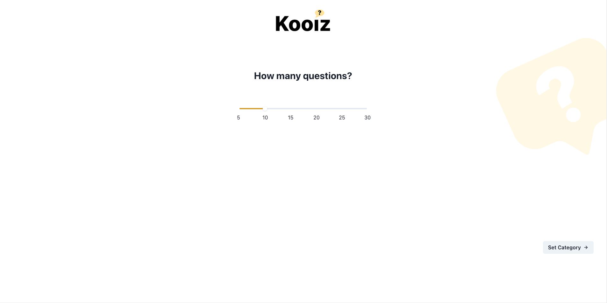
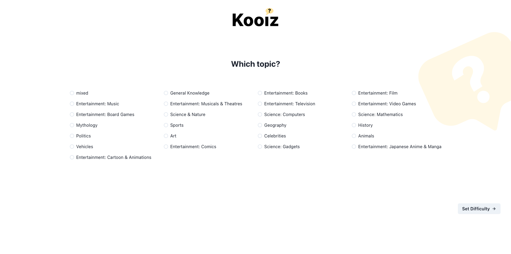
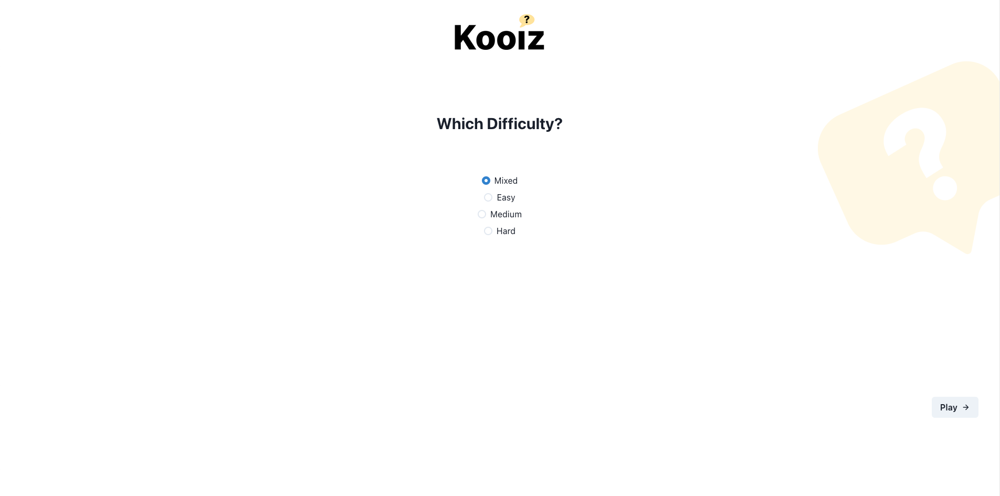
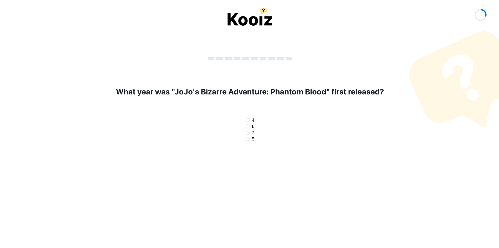
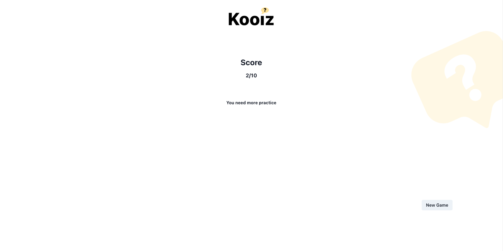

# Typescript Project: Kooiz App

This project is the capstone project of the course: https://www.udemy.com/course/typescript-the-beginner-guide/ - by Robin Lebhar

Within it, the following tools and Typescript concepts are leveraged:

#### Tech used:

- ChakraUI
- Lottie Animations
- HTML
- CSS
- Typescript

#### Typescript Concepts & Friends used:

- Enumerated, Array, & Custom Types
- As Operator
- Double Ternary Operations

### How to play

1. Give it a number of questions you'd like to play through.
2. Select a category of trivia questions.
3. Select your difficulty.
4. Answer the Question.
5. Try to beat your score!

Try not to let the time run out or it will count against your score!

### Screenshots

